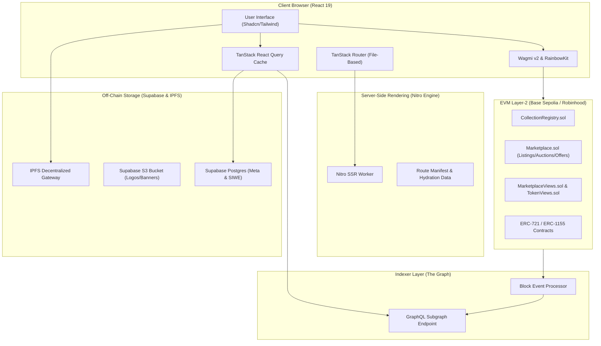

# Zenkaihood (NexDrop) NFT Marketplace — Full Technical Documentation

---

## 1. Executive Summary & Architecture

**Zenkaihood** (also known as **NexDrop**) is an enterprise-grade, high-performance decentralized NFT marketplace built on Ethereum Layer-2 infrastructure (**Base Sepolia** and **Robinhood Chain Testnet**).

The application is engineered with a hybrid Web3 architecture combining:
1. **On-Chain Smart Contracts** for non-custodial listings, English auctions, offers, escrow, and EIP-2981 royalties.
2. **Decentralized Subgraph (The Graph)** for sub-second GraphQL indexing of marketplace events and historical activity.
3. **Off-Chain Relational DB & CDN (Supabase)** for collection metadata, creator verification, category classification, and media assets.
4. **Modern SSR Frontend (TanStack Start + Nitro)** with client hydration, Tailwind CSS design system, and multi-RPC Web3 wallet connectivity.



---

## 2. Blockchain & Smart Contract Matrix

### 2.1 Supported Networks

| Parameter | Primary Network | Secondary Network |
|---|---|---|
| **Network Name** | Base Sepolia Testnet | Robinhood Chain Testnet |
| **Chain ID** | `84532` | `46630` |
| **Currency** | Sepolia ETH | Robinhood Testnet ETH |
| **Block Explorer** | [BaseScan Sepolia](https://sepolia.basescan.org) | Robinhood Explorer |
| **RPC Fallbacks** | `sepolia.base.org`, `base-sepolia-rpc.publicnode.com`, `base-sepolia.drpc.org`, `base-sepolia.gateway.tenderly.co` | `rpc.testnet.chain.robinhood.com` |

### 2.2 Deployed Protocol Contracts (`src/contracts/addresses.ts`)

```typescript
export const ADDRESSES = {
  [baseSepolia.id]: {
    registry: "0xABCB5db96fcB6a9743Da56F4d4870B3505eBAD85",
    marketplace: "0x1E4b93C28B1Cc2135894521a3b1b4d58cc21da5d",
    marketplaceViews: "0x4CA91348E44481C2dc923FfC69f8017Ac4731FcD",
    tokenViews: "0x8118a477450cf4d7581cdf0dc973ed22cdcc4f24",
  },
  [robinhoodTestnet.id]: {
    registry: "0xABCB5db96fcB6a9743Da56F4d4870B3505eBAD85",
    marketplace: "0x1E4b93C28B1Cc2135894521a3b1b4d58cc21da5d",
    marketplaceViews: "0x4CA91348E44481C2dc923FfC69f8017Ac4731FcD",
    tokenViews: "0x8118a477450cf4d7581cdf0dc973ed22cdcc4f24",
  },
} as const;
```

### 2.3 Protocol Contract Specifications

#### `CollectionRegistry.sol`
- **Permissionless Collection Registration:** Creators register their ERC-721 or ERC-1155 smart contracts to activate marketplace trading.
- **Royalty Management:** Enforces collection-level creator royalty basis points (up to 1000 bps / 10%) and payout recipient address.
- **Verification System:** Role-based (`VERIFIER_ROLE`) verification badge system.
- **Circuit Breaker:** Emergency pausing via `PAUSER_ROLE`.

#### `Marketplace.sol`
- **Fixed Price Listings:** Direct sales with support for ETH and ERC-20 payment tokens (`0x000...` = ETH).
- **English Live Auctions:** On-chain bidding with reserve prices, 5% minimum bid step, and **Anti-Sniping Engine** (bids placed within the final 5 minutes automatically extend auction duration by +5 minutes).
- **Item & Collection Offers:** Bidders deposit escrow funds to make individual or trait offers; sellers execute with 1 click.
- **Bulk Floor Sweeping:** Atomic multi-item checkout in a single transaction via `buyListingBatch` / cart.
- **Non-Custodial Escrow:** Outbid auction bids and cancelled offers can be reclaimed directly by users at any time.
- **EIP-2981 Creator Royalties:** Automatic splits for creator payouts and marketplace platform fees on secondary sales.

---

## 3. Application Routing & Page Specifications

The project uses TanStack Start **file-based routing** located in `src/routes/`.

```
src/routes/
├── __root.tsx             # Root layout, HTML shell, Providers & Global Error Boundary
├── index.tsx              # Marketplace Homepage & Spotlights
├── explore.tsx            # Full Marketplace Discovery & Multi-Facet Filters
├── collections.$slug.tsx  # Collection Detail (Items, Analytics, Offers, Activity, About)
├── nfts.$id.tsx           # Individual NFT Token Page & Action Panels
├── create.tsx             # Creator Studio (Collection Registration & Deployment)
├── edit-collection.tsx    # Collection Settings, Metadata & Payout Config
├── listings.tsx           # Global Live Listings Grid
├── activity.tsx           # Global Real-Time Activity Feed
├── profile.tsx            # User Profile, Bio & Connected Wallet
├── my-nfts.tsx            # User Portfolio & Instant Listing Interface
├── my-activity.tsx        # User History (Bids, Offers, Purchases, Sales)
└── admin.tsx              # Protocol Administration & Governance Portal
```

---

### 3.1 Homepage (`/` -> `src/routes/index.tsx`)

The homepage delivers an OpenSea-grade experience with 10 integrated modules:

1. **Global Marketplace Stats Ribbon:** Real-time strip displaying active network, Total Volume, 24h Volume, 24h Sales count, total collections, and active platform fee badge (`0% Fee Marketplace`).
2. **CSS Marquee Live Sales Feed:** Hardware-accelerated infinite scrolling ticker displaying recent sales with collection name, tokenId, ETH price, and relative timestamp (`12s ago`). Pauses on hover.
3. **Spotlight Hero Drop Carousel:** Dynamic hero featuring top verified collections with background ambient glow, backdrop artwork, live floor/volume metrics, and integrated autocomplete search.
4. **Category Quick-Filter Bar:** Sticky filter strip across categories (All, Art, Gaming, Photography, Collectibles, Music, Virtual Worlds).
5. **OpenSea-Style Trending & Top Leaderboards:**
   - 2-column split ranking table (Ranks 1–5 and 6–10).
   - Dynamic timeframe tabs (`1h`, `6h`, `24h`, `7d`, `All`).
   - Timeframe volume calculation and floor price metrics with color-coded **+X% / -X% badges** (`ArrowUpRight` / `ArrowDownRight`).
6. **Notable Collections Carousel:** Horizontal scrollable preview cards with smooth `‹` / `›` navigation buttons and fade-edge gradient masks.
7. **Trending Items / Featured Listings:** 6-column NFT grid featuring **1-Click Quick Buy hover overlay** ("Buy Now · 0.05 ETH") sliding from the bottom of each tile.
8. **Live Anti-Sniping Auctions:** Live auction grid with real-time ticking `HH:MM:SS` countdown clocks and red pulsing state for auctions in the <5 min anti-sniping extension window.
9. **Browse by Category Carousel:** Registered collections grouped by creator-tagged taxonomy.
10. **"Why Zenkaihood" Trust & Ecosystem Section:** 4-pillar architectural advantage grid (Anti-Sniping, Base L2 Gas, Non-Custodial Escrow, EIP-2981 Royalties) + BaseScan bytecode verification trust badges.
11. **Creator Studio Launchpad Banner:** CTA to deploy and register collections.

---

### 3.2 Collection Details (`/collections/$slug` -> `src/routes/collections.$slug.tsx`)

Comprehensive hub for browsing and trading collections:

- **Identity & Socials Hero:** Banner, logo, verified badge, description collapse, socials (Website, X/Twitter, Discord, Telegram, BaseScan).
- **Live Metrics Ribbon:** 8 KPI cards (Floor Price, Top Offer, 24h Volume, Total Volume, Listed %, Owners count, Unique Holders %, Auction count).
- **5 Tabbed Sections:**
  1. **Items Tab:**
     - Left sidebar with **Trait Filter Engine** (accordion of trait types, counts, and live floor prices per trait).
     - Status filters (`Buy Now`, `On Auction`, `Not Listed`), min/max price filter, token ID search.
     - Sort options (Price Low/High, Rarity Rare/Common, Recently Listed, Token ID).
     - View switch (Grid density 3/4/5 vs Table row mode).
     - **Statistical Rarity Scoring:** Rarity pills (`Top 1%`, `Top 5%`, `Top 10%`, `#Rank`).
     - **Seller Self-Protection:** If the viewing wallet owns a listed NFT, displays `Manage Listing` / `Manage Auction` instead of Buy/Bid buttons; displays `You` in seller column.
     - **Sticky Sweeper Floating Bar:** Floor price sweep counter, sweep dialog, and "Buy Floor" 1-click execution.
  2. **Analytics Tab:**
     - Interactive Recharts **Sales Timeline Area Chart** displaying historical trade prices over time.
     - **Price Bracket Distribution Histogram** (`< 0.05 ETH`, `0.05 - 0.2 ETH`, `0.2 - 0.5 ETH`, `> 0.5 ETH`).
     - Market Depth inventory breakdown (Listed vs Unlisted vs Active Offers).
  3. **Offers Tab:** Live collection offer book with token ID, amount in ETH, offerer address, and expiration date.
  4. **Activity Tab:** Real-time event log for Listing, Sale, Offer, Auction, and Bid events.
  5. **About Tab:** Full contract metadata, creator address, standard, supply, and royalty breakdown.

---

### 3.3 NFT Item Details (`/nfts/$id` -> `src/routes/nfts.$id.tsx`)

Detailed token-level trading terminal:

- **Media Canvas:** IPFS media renderer with full-resolution expander.
- **Traits & Properties Grid:** Visual trait chips showing trait type, value, trait frequency percentage across collection, and trait floor price.
- **Price & Trade History:** Line chart of all historic sales for this individual token ID.
- **Contextual Action Modals:**
  - **Buy Now:** Direct atomic purchase via `buyListing`.
  - **Place Bid:** Bidding dialog checking 5% minimum bid step and anti-sniping extension window.
  - **Make Offer:** On-chain escrow offer with customizable expiration timestamp.
  - **List for Sale:** Seller modal for fixed-price listing or English auction deployment.
  - **Manage / Cancel Listing:** 1-click non-custodial cancellation.

---

### 3.4 Creator Studio (`/create` -> `src/routes/create.tsx`)

Multi-step onboarding pipeline for creators:

1. **Contract Connection:** Validates ERC-721 or ERC-1155 contract address on Base Sepolia.
2. **Ownership Verification:** On-chain check verifying connected wallet is the contract `owner()`.
3. **On-Chain Registration:** Executes `registerCollection(address, standard, royaltyRecipient, royaltyBps)`.
4. **SIWE Wallet Authentication:** Signs deterministic message to establish authenticated Supabase creator session.
5. **Off-Chain Enrichment:** Uploads logo and banner images to Supabase CDN, saves collection description, social links, and category tags.

---

### 3.5 Admin & Governance Portal (`/admin` -> `src/routes/admin.tsx`)

Protocol management portal protected by on-chain `AccessControl` checks:

- **Collections & Verification:** Search, approve, or revoke verified badges (`setCollectionVerified`).
- **Marketplace & Fee Settings:** Update protocol platform fee (`setPlatformFeeBps`, max 500 bps / 5%) and fee recipient address.
- **Circuit Breakers:** Toggle emergency pause/unpause on Marketplace and CollectionRegistry contracts.
- **Roles & Governance:** Grant or revoke `DEFAULT_ADMIN_ROLE`, `VERIFIER_ROLE`, and `PAUSER_ROLE`.
- **Market Oversight:** Live protocol revenue analytics, total sales volume across contracts, and active escrow reserves.

---

## 4. Data Layer & Indexing Architecture

### 4.1 Hybrid Storage Model

| Data Domain | Storage Technology | Source of Truth |
|---|---|---|
| **Token Ownership & Balances** | Ethereum L2 Smart Contracts | On-chain |
| **Listings, Bids, Escrow & Offers** | `Marketplace.sol` | On-chain |
| **Marketplace Events & Sales History** | The Graph Subgraph | Indexer |
| **NFT Artwork & Token Metadata JSON** | IPFS (Pinata / Decentralized Nodes) | Decentralized Storage |
| **Collection Logos, Banners & Socials** | Supabase Postgres + S3 Storage | Off-chain |
| **Collection Categories & Taxonomy** | Supabase `collections` table | Off-chain |

### 4.2 Subgraph Query Catalog (`src/indexer/queries.ts`)

The marketplace uses optimized GraphQL queries with automatic polling:

- `GET_MARKETPLACE_CONFIG`: Global fee, recipient, and pause states.
- `GET_COLLECTIONS` / `GET_VERIFIED_COLLECTIONS`: Paginated collection index.
- `GET_ACTIVE_LISTINGS`: Non-expired active fixed-price listings filtered by `now <= endTime`.
- `GET_ACTIVE_AUCTIONS`: Non-expired live English auctions.
- `GET_OFFERS_BY_COLLECTION`: Active token and collection offers.
- `GET_SALES` / `GET_SALES_BY_COLLECTION`: Historic completed trade events.
- `GET_ACTIVITY_BY_COLLECTION`: Unified activity timeline (Listings, Sales, Transfers, Bids, Offers).

---

## 5. Custom React Hooks Catalog

```
src/hooks/
├── useMarketplace.ts        # Buy, list, cancel, and sweep interactions
├── useMarketplaceConfig.ts  # Protocol fees and pause state
├── useListingQuote.ts       # Price + fee + royalty calculation quotes
├── useAuction.ts            # Place bid, create auction, settle auction
├── useOffer.ts              # Make, accept, and cancel escrow offers
├── useSweepCart.ts          # Zustand-like cart state for multi-item sweep
├── useSweep.ts              # Atomic batch transaction execution
├── useCollectionMeta.ts     # Supabase off-chain metadata loader (single collection)
├── useCollectionsMeta.ts    # Batch Supabase metadata loader (multi-collection)
├── useCollectionSupply.ts   # Multi-ABI token supply detector (totalSupply/totalMinted)
├── useCollectionTraits.ts   # Trait aggregation and statistical rarity engine
├── useTokenMetadata.ts      # Client-safe token metadata and IPFS image resolver
├── useRegistry.ts           # Collection registration and metadata URI updates
└── useAdmin.ts              # AccessControl roles and governance actions
```

---

## 6. Security, Reliability & SSR Guardrails

### 6.1 Server-Side Rendering (Nitro SSR) Rules
To prevent production hydration failures and worker crashes:
1. **Never return raw `bigint`, `Map`, or `Set` from React Query `queryFn`:** All queries return plain objects/arrays with numbers or string representations of BigInts.
2. **Safe BigInt Parsing:** Use `safeBigInt(val, fallback = 0n)` instead of raw `BigInt(val)` to prevent syntax errors on undefined/empty values.
3. **Unconditional React Hooks:** Hooks like `useWallet()` must be declared at the top of components before any early returns.
4. **Client-Gated Contract Reads:** Card-level `useReadContract` calls must be guarded with `typeof window !== "undefined"` to prevent un-gated server RPC flooding.

### 6.2 Non-Custodial Security Model
- All listing approvals use standard ERC-721 / ERC-1155 operator approvals (`setApprovalForAll`).
- Marketplace contracts never take custody of unlisted NFTs.
- Escrow funds for active offers and outbid auction bids remain locked in audited contract storage and can be reclaimed by users at any time without admin intervention.

---

## 7. Environment Variables & Deployment

### 7.1 Configuration Matrix (`.env`)

```bash
# Network & RPC
VITE_WALLETCONNECT_PROJECT_ID="your_walletconnect_project_id"

# The Graph Subgraph Endpoint
VITE_SUBGRAPH_URL="https://api.studio.thegraph.com/query/1760437/zenkaihood-1/0.0.1"

# Supabase Off-chain Database
VITE_SUPABASE_URL="https://your-supabase-project.supabase.co"
VITE_SUPABASE_ANON_KEY="your_supabase_anon_public_key"

# IPFS Gateway Override (Optional)
VITE_IPFS_GATEWAY="https://ipfs.io/ipfs/"
```

### 7.2 Build & Verification Commands

```powershell
# Install dependencies
npm install

# Run local development server (Vite + SSR)
npm run dev

# Run full production build (Client + Nitro SSR Worker)
cmd /c "npm run build"

# Code styling & linting
npm run lint
npm run format
```
