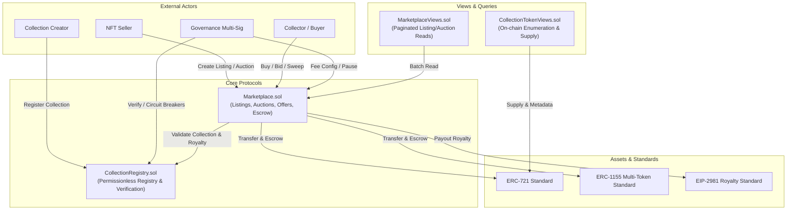
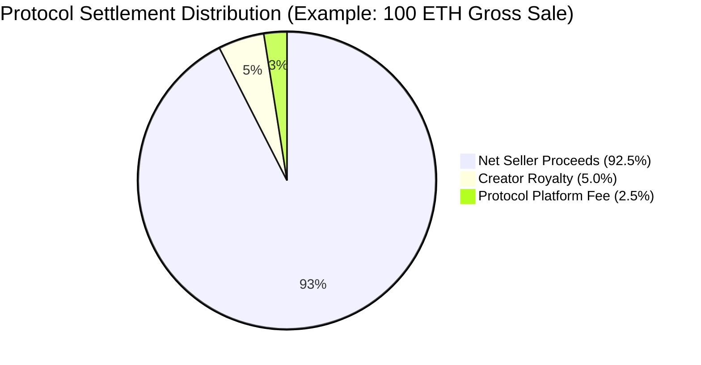
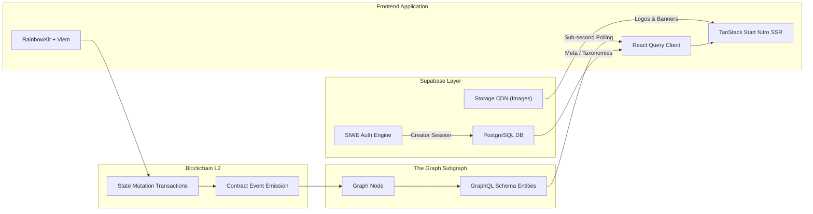
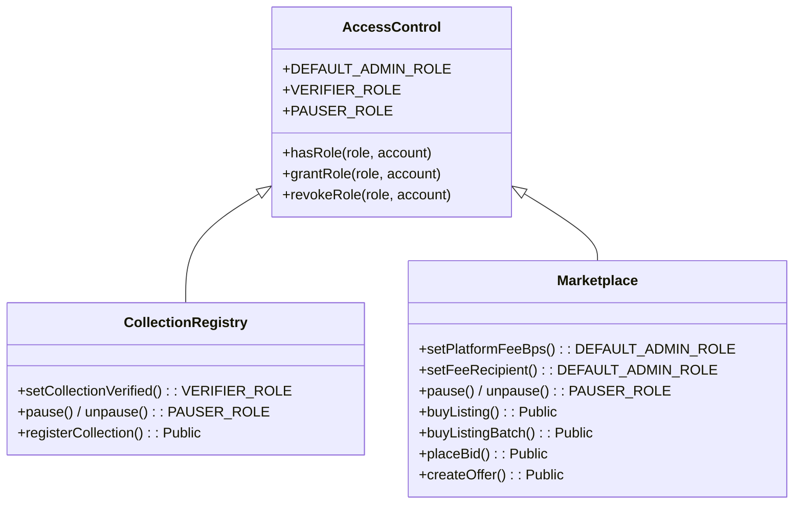
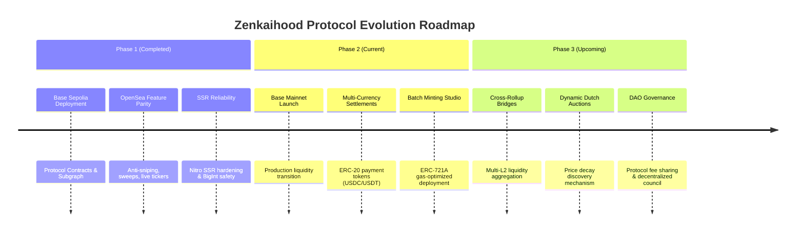

# Zenkaihood Protocol Whitepaper v1.0
## A High-Throughput, Anti-Sniping Decentralized NFT Marketplace & Creator Liquidity Protocol

**Abstract**  
Non-Fungible Token (NFT) marketplaces on legacy Layer-1 networks face prohibitive gas costs, vulnerable auction dynamics prone to MEV/sniper bots, fragmented creator royalty enforcement, and centralized custodial failure points. The **Zenkaihood Protocol** (internally operating as **NexDrop**) introduces a high-performance, non-custodial decentralized marketplace architecture natively deployed on Ethereum Layer-2 (Base Sepolia and EVM-compatible rollups). Zenkaihood integrates dynamic anti-sniping English auctions with automated time-extension triggers, atomic multi-item floor sweeps, protocol-level EIP-2981 royalty splits, and a hybrid decentralized indexing architecture combining on-chain state verification, The Graph subgraphs, and SIWE-authenticated off-chain metadata. This paper outlines the protocol design, mathematical formulation, smart contract architecture, economic model, and security guarantees of Zenkaihood.

---

## 1. Introduction & Problem Space

### 1.1 The Trilemma in Modern NFT Trading
Digital asset trading infrastructure on EVM networks has historically been bottlenecked by four core systemic vulnerabilities:

1. **Auction Sniping & MEV Extraction:** On fixed-deadline auctions, automated arbitrage and sniper bots leverage block manipulation and private transaction bundles (Flashbots) to submit winning bids in the final block sub-second, depriving genuine collectors and creators of organic price discovery.
2. **Layer-1 Gas Inefficiency:** High base gas fees make micro-transactions, bulk collection sweeping, and low-value NFT trading economically unviable.
3. **Fragile Custodial & Off-Chain Models:** Centralized marketplaces store off-chain order books with opaque custody or unverified trade settlement, exposing users to systemic counterparty risk.
4. **Creator Royalty Disintermediation:** The degradation of royalty enforcement in legacy marketplaces has weakened creator incentives and secondary market longevity.

### 1.2 The Zenkaihood Solution
Zenkaihood addresses these structural inefficiencies by establishing:
- **Layer-2 Scalability:** Sub-cent execution costs and sub-second block finality on Base Sepolia.
- **On-Chain Anti-Sniping Engine:** Dynamic auction extension algorithms preventing last-second frontrunning.
- **Immutable Non-Custodial Architecture:** Direct smart contract escrow with instantaneous, trustless fund reclamation.
- **Deterministic EIP-2981 Enforcement:** Multi-standard royalty support across ERC-721 and ERC-1155 tokens.
- **Hybrid SSR & Indexing Stack:** Zero-latency client-side discovery backed by decentralized subgraph nodes.

---

## 2. Protocol Architecture & Smart Contract Topology

The Zenkaihood protocol is composed of four modular on-chain contracts decoupled for upgradability, security, and gas optimization.

### 2.1 Core Contracts Specification

#### 1. `CollectionRegistry.sol`
Serves as the global registry of verified and community-registered digital asset collections.
- **Registration Pipeline:** Creators register their ERC-721 or ERC-1155 contract address, specifying metadata URI, token standard, royalty recipient, and royalty basis points ($0 \le \text{bps} \le 1000$).
- **Verification Engine:** Governed by `VERIFIER_ROLE` to grant cryptographic verified badges (`verified = true`).
- **Emergency Circuit Breaker:** Governed by `PAUSER_ROLE` to freeze new registrations during security incidents.

#### 2. `Marketplace.sol`
The central execution engine governing all transactional flows:
- **Direct Fixed-Price Listings:** Non-custodial item listing using operator approval (`setApprovalForAll`).
- **Dynamic English Auctions:** Anti-sniping live bidding with automated reserve thresholds.
- **Escrow-Backed Offers:** Direct token offers and collection-wide bids with on-chain collateralization.
- **Atomic Multi-Item Sweeps (`buyListingBatch`):** Batch purchase function that fulfills multiple listings across collections in a single transaction with automatic fee routing.

#### 3. `MarketplaceViews.sol` & `CollectionTokenViews.sol`
Gas-optimized view contracts providing paginated array lookups for active listings, auctions, token supplies (`totalSupply`, `totalMinted`, `maxSupply`), and ownership status without generating state-modifying gas overhead.

---

## 3. Mathematical Models & Execution Dynamics

### 3.1 Anti-Sniping Auction Dynamics

Standard English auctions terminate at a fixed timestamp $T_{\text{end}}$. Zenkaihood implements a dynamic time-extension threshold $\Delta t_{\text{window}} = 300\text{ seconds}$ (5 minutes) with an extension duration $\Delta t_{\text{ext}} = 300\text{ seconds}$.

$$\text{Let } t_{\text{bid}} \text{ be the block timestamp of an incoming bid.}$$

$$T_{\text{end}}^{\prime} = \begin{cases} 
T_{\text{end}} + \Delta t_{\text{ext}} & \text{if } (T_{\text{end}} - t_{\text{bid}}) \le \Delta t_{\text{window}} \\
T_{\text{end}} & \text{if } (T_{\text{end}} - t_{\text{bid}}) > \Delta t_{\text{window}}
\end{cases}$$

This guarantees that any competitive bid placed within the final 5 minutes restarts a 5-minute bidding grace period, completely neutralizing bot snipers and maximizing creator settlement value.

### 3.2 Minimum Bid Increment Rule

To prevent micro-spamming and transaction griefing, every subsequent auction bid must strictly exceed the current highest bid by a minimum increment parameter $\alpha = 5\%$:

$$\text{Bid}_{\text{min}} = \begin{cases}
\text{ReservePrice} & \text{if } \text{HighestBid} = 0 \\
\left\lceil \text{HighestBid} \times \left(1 + \frac{\alpha}{100}\right) \right\rceil = \left\lceil \text{HighestBid} \times 1.05 \right\rceil & \text{if } \text{HighestBid} > 0
\end{cases}$$

### 3.3 Settlement & Payout Distribution Formulation

When a direct sale, auction settlement, or accepted offer executes at gross price $P_{\text{gross}}$, the protocol executes an atomic settlement split:

$$\text{Platform Fee: } F_{\text{platform}} = \left\lfloor \frac{P_{\text{gross}} \times \text{bps}_{\text{platform}}}{10000} \right\rfloor \quad (\text{capped at } 500\text{ bps / } 5\%)$$

$$\text{Creator Royalty: } R_{\text{creator}} = \left\lfloor \frac{P_{\text{gross}} \times \text{bps}_{\text{royalty}}}{10000} \right\rfloor \quad (\text{capped at } 1000\text{ bps / } 10\%)$$

$$\text{Net Seller Payout: } P_{\text{seller}} = P_{\text{gross}} - (F_{\text{platform}} + R_{\text{creator}})$$

$$\text{Conservation of Value Guarantee: } P_{\text{seller}} + F_{\text{platform}} + R_{\text{creator}} = P_{\text{gross}}$$

All payouts execute atomically in the same transaction block, ensuring zero counterparty or default risk.

---

## 4. Economic Architecture & Fee Model

### 4.1 Fee Configuration & Governance
- **Current Marketplace Fee:** Configurable from **0.0%** up to a protocol-enforced ceiling of **5.0%** (500 bps).
- **Creator Royalties:** Configured directly by collection creators (0% to 10%) and enforced at the smart contract level via EIP-2981 and `CollectionRegistry`.
- **Zero-Custody Escrow Model:** Outbid auction bidders receive automatic credits or instant refunds. Active offers lock funds in non-custodial contract escrow, which offerers can cancel and reclaim at any time.

---

## 5. Statistical Rarity & Discovery Engine

Zenkaihood features an integrated **Statistical Rarity Scoring Engine** operating over decentralized collection metadata.

### 5.1 Rarity Score Mathematical Model

For a given collection with total supply $N$ and a set of trait categories $C = \{c_1, c_2, \dots, c_k\}$:

$$\text{Let } f(c_i, v) \text{ be the frequency count of trait value } v \text{ in category } c_i \text{ across the collection.}$$

$$\text{Rarity Score of Token } T: \quad S(T) = \sum_{i=1}^{k} \frac{N}{\max(1, f(c_i, v_T))}$$

The collection is sorted descending by $S(T)$ to determine exact ordinal rank $R(T) \in [1, N]$ and percentile ranking:

$$\text{Percentile}(T) = \left\lceil \frac{R(T)}{N} \times 100 \right\rceil$$

Tokens are badged dynamically in the interface:
- **Top 1%:** Ultra Rare (`bg-purple-600`)
- **Top 5%:** Legendary (`bg-amber-500`)
- **Top 10%:** Rare (`bg-blue-600`)
- **Common:** Standard (`bg-muted`)

---

## 6. Hybrid System Architecture & Data Topology

### 6.1 Layer Invariants & Redundancies

1. **On-Chain Truth:** Smart contract balances and listings are the immutable single source of truth.
2. **Sub-second Polling:** The Graph subgraph indexes blocks in real-time, polled via React Query with high-frequency intervals (`DEFAULT_REFETCH_MS = 4000ms`, `SLOW_REFETCH_MS = 12000ms`).
3. **Multi-RPC Failover:** Web3 connections use Viem `fallback([...])` across 4 independent RPC endpoints (`sepolia.base.org`, `publicnode.com`, `drpc.org`, `tenderly.co`).
4. **Sign-In with Ethereum (SIWE):** Creator management actions use deterministic signature-derived authentication to verify wallet identity before metadata ingestion.
5. **Decentralized IPFS Resolution:** Dual-mode IPFS resolution (`ipfs://` protocol parsing + multi-gateway fallback via Pinata and local caching proxies).

---

## 7. Security, Access Control & Auditing Standards

### 7.1 AccessControl Hierarchy

### 7.2 Security Invariants
- **Reentrancy Protection:** All fund transfers follow the Checks-Effects-Interactions pattern and utilize OpenZeppelin `ReentrancyGuardUpgradeable`.
- **Pull-Over-Push Escrow Refunds:** Outbid funds and offer cancellations utilize user-initiated withdrawal patterns or safe low-level call execution to prevent DoS refund traps.
- **SSR Precision Safety:** No raw `BigInt` or `Map` data structures escape query handlers into SSR serialization, preventing hydration state desynchronization.

---

## 8. Protocol Roadmap & Future Developments

---

## 9. Conclusion

The **Zenkaihood Protocol** represents a next-generation standard for digital art and NFT trading on Layer-2 Ethereum. By unifying high-throughput execution on Base Sepolia, cryptographically enforced anti-sniping auctions, statistical rarity scoring, atomic bulk floor sweeps, and a resilient hybrid decentralized indexing model, Zenkaihood provides creators and collectors with an equitable, transparent, and ultra-low-cost trading ecosystem.

---

*© 2026 Zenkaihood (NexDrop) Protocol. Built for decentralized creator economies.*
